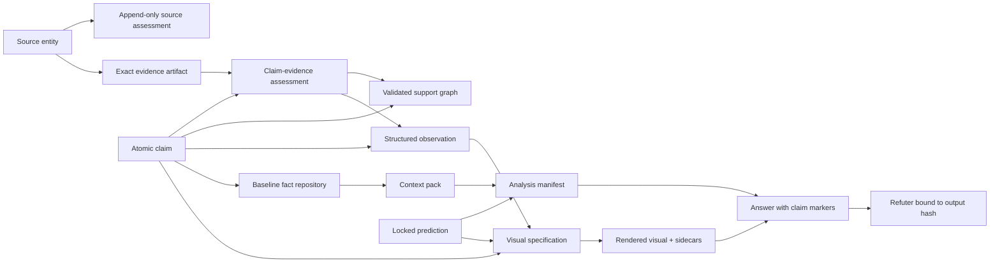

# Analyst Harness v3

A private, single-user research system for following a live, disinformation-heavy
conflict (Russia/Ukraine) without rebuilding the same facts from scratch every session.

It has four jobs:

1. separate source identity, evidence, claims, assumptions, inferences, and forecasts;
2. maintain a small repository of carefully checked geography, history, definitions, and
   other reusable facts;
3. bind each answer to the exact claims, reviews, predictions, and visuals it uses;
4. generate charts, timelines, maps, and schematics from records rather than model memory.

> **Green means the requested checks genuinely ran and the recorded relationships are
> coherent. It never means reality signed the YAML.** A passing gate is coherent
> bookkeeping, not a truth certificate.

## Status

**Phases 0–3 are built and green — the full conversational → recorded → committed-answer loop,
through the refuter (Milestone A). Phase 4 (the baseline fact repository) is built as a lean MVP:
`fact.py add / query / source / supersede / review-due`, with multi-assessment contested facts and
the §6.1c A–C corroboration leg.**

| Layer | State |
|---|---|
| Phase 0 — scaffold, review-adjudication gate, sensitive-scan, Tier-0 contract | **built** (WP0.0–0.3) |
| Phase 1 — closed record schemas + golden canonicalization vector | **built** (WP1.1–1.6) |
| Phase 2 — 8 record-integrity gates + `records` composition + exit gate | **built** (WP2.1–2.8) |
| Phase 3 — `draft` / `answer` modes + output binding + required refuter | **built** (WP3.0–3.4, Milestone A) |
| Phase 4 — fact repository: `fact.py add/query/source/supersede/review-due` | **built (lean MVP)** — context-pack builder + lifecycle eval still to come |
| Phases 5–7 — visuals, forecast calibration, semantic assist | **planned** |

- **488 tests pass** (`pytest`). The three machine phase-gates —
  `scripts/gate_phase{1,2,3}_exit.py` — each exit `0`.
- The committed-answer loop has been hardened across three independent cross-vendor review
  rounds (see `docs/REVIEW_CROSSVENDOR.md`). Remaining known gaps are deliberate-adversary
  constructions outside this tool's threat model (below), not honest-use failures.

This is a working harness, not a finished product. The unbuilt modes fail closed (exit `2`),
never silently pass.

### What this defends against — and what it does not

This is a **private, single-user** tool. Its job is to keep an AI assistant (and the user)
**honest and traceable**: every committed claim traces to a real source and exact locator; the
"is this high-impact / contested / stale" labels are **computed from the records, not asserted**;
a committed answer is bound to its exact inputs and checked by an independent refuter.

- **It defends against** the realistic failure modes of AI-assisted research — a confidently
  wrong or unsupported claim, a contested point shipped as settled, a stale fact reused, an
  error inherited from a previous session's memory.
- **It does not claim to resist a deliberate adversary** who forges internally-consistent
  records and recomputes the content hashes to evade the checks. There is no such adversary for
  a single-user tool, so that is out of scope. For a high-stakes Tier-2 answer the **independent
  human / different-model refuter is the control**; the gates make its job easier and catch
  mechanical self-deception, but they are a coherence floor, not a truth certificate
  (Constitution §15).

## Quickstart

Requires Python 3.11+.

```bash
python3 -m venv .venv
.venv/bin/pip install -r requirements-dev.txt
.venv/bin/python -m pytest                          # 488 tests
.venv/bin/python scripts/verify.py --mode scaffold  # governance + scaffold check → exit 0
```

`--mode scaffold` checks the governing documents, the review-adjudication state, the runtime
directories, and dependency availability. `--mode records` composes the Phase-2 integrity gates
over the factbase, but the seed factbase ships **empty of claims by design**, so on a clean
checkout it fails closed (exit `2`, "empty factbase") — that is the correct, honest result, not
a bug. See `tests/` for synthetic fixtures that exercise the gates end to end.

## Exit-code contract

Every gate and mode obeys one contract (AGENTS.md §13, `docs/TOOLING.md`):

| Code | Meaning |
|---|---|
| `0` | clean — the requested checks ran and found no findings |
| `1` | findings in otherwise-valid input (e.g. an over-claimed support status) |
| `2` | cannot run / unavailable — missing input, empty factbase, or a not-yet-built mode (**fail closed**) |

`SKIP` is never `PASS`. An inactive control returns `2`, not a quiet `0`.

## The tier model — rigor is opt-in

Three tiers of rigor, default lightweight (Constitution §1):

- **Tier 0 — Conversational (default, most questions):** a direct answer with honest labels
  (fact / inference / assumption / projection + a coarse confidence), speculation encouraged
  and badged, one self-refute line. **No records, no manifest, no refuter.** This is the
  everyday mode. It is a discipline, not software — usable on day zero. See
  `docs/CONVERSATION.md`. `verify.py --mode conversational` prints a notice and is *never* a
  gate PASS.
- **Tier 1 — Recorded:** worth keeping → a candidate claim + evidence + assessment, validated
  by the Phase-1/2 schema and integrity gates.
- **Tier 2 — Committed answer:** worth depending on → the full chain below, bound to exact
  hashes and a required refuter (Phase 3).

The heavy chain is escalation, not the price of speaking. Never silently force it onto a casual
question.

## Architecture



The separations are load-bearing and the gates enforce them: source **type** is not assessed
**reliability**; reliability is not information **credibility**; an artifact is not a claim
verdict; a claim is not a chart datum; corroboration counts independent information *origins*
(by connected component over shared origin source or independence group, not outlet logos);
same-model fresh-context review is not independent review; Git history is not an immutable
prediction anchor.

## Honest verification modes

| Mode | Establishes | State |
|---|---|---|
| `conversational` | Tier-0 notice — UNVERIFIED BY DESIGN, never a PASS | **available** |
| `scaffold` | governance, required files, dependencies, schema availability | **available** |
| `records` | source, artifact, assessment, claim, support, conflict, freshness, observation integrity | **available** |
| `draft` | records plus analysis-manifest and projection-link integrity | **available** (Phase 3) |
| `answer` | draft plus output binding, visual hashes, and required refuter review | **available** (Phase 3) |

None proves semantic truth. Exact support locators and adversarial review make judgment
inspectable; they do not automate it into existence.

## Commands

**Available now:**

```bash
.venv/bin/python -m pytest                                   # full suite (488)
.venv/bin/python scripts/verify.py --mode conversational     # Tier-0 notice (exit 0, not a PASS)
.venv/bin/python scripts/verify.py --mode scaffold           # governance + scaffold (exit 0/2)
.venv/bin/python scripts/verify.py --mode records --as-of 2026-06-23T00:00:00Z  # integrity composition (exit 0/1/2)
.venv/bin/python scripts/verify.py --mode draft --analysis ana-id    # Phase-3 draft composition (exit 0/1/2)
.venv/bin/python scripts/verify.py --mode answer --analysis ana-id   # Phase-3 committed answer + refuter (exit 0/1/2)
.venv/bin/python scripts/gate_phase1_exit.py                 # Phase-1 machine gate (exit 0/2)
.venv/bin/python scripts/gate_phase2_exit.py                 # Phase-2 machine gate (exit 0/2)
.venv/bin/python scripts/gate_phase3_exit.py                 # Phase-3 machine gate (exit 0/2)

# Phase-4 fact repository (lean MVP) — point --root at a corpus dir (default: the repo)
.venv/bin/python scripts/fact.py add <spec.yaml> --as-of <ts>        # build a checked fact, fail-closed
.venv/bin/python scripts/fact.py query [--topic/--text/--id] [--support-status …] [--format yaml|json]
.venv/bin/python scripts/fact.py source <spec.yaml> --as-of <ts>     # scoped A–F reliability ratings
.venv/bin/python scripts/fact.py supersede --target <id> --as-of <ts> [...]   # append-only correction
.venv/bin/python scripts/fact.py review-due --as-of <ts>             # facts whose review/expiry passed
```

**Planned (not yet built — these scripts do not exist yet):**

```bash
# scripts/fact.py context  — deterministic context-pack builder (Phase 4, remaining)
# scripts/prediction.py    — lock / resolve / score (Phase 6)
# scripts/visual.py        — validate / render / inspect (Phase 5)
```

Canonical commands use `.venv/bin/python`; there is no split-brain `python` vs `python3`
documentation.

## What this public repository contains

This repo is published as the **build artifact and method**: the validation framework, the
governance/design documents, synthetic test fixtures, and an empty seed factbase. It contains
**no live OSINT research corpus**.

- The factbase ships **empty of claims, evidence, observations, and predictions**. The only
  populated file is `factbase/sources.yaml` — neutral public source *identity* metadata
  (organization names and official URLs), with **no reliability grades or method notes**.
- All fixtures under `tests/` are **synthetic** — coherent shapes that exercise the gates, not
  real intelligence.
- Real research is seeded only after the record and support gates exist and only through the
  retrieve→assess→review→promote path — never dictated from model memory and blessed
  retrospectively (CLAUDE.md, `docs/CONSTITUTION.md`).
- `scripts/sensitive_scan.py` guards against tracked secrets, signed URLs, private document IDs,
  local paths, and named-person reliability notes. Signed URLs and sensitive method notes belong
  in the git-ignored `private/` overlay, never in tracked YAML.

If this harness is ever used against a live corpus, that corpus stays local and private; a
public/redacted export would be a separate, explicitly threat-modeled mode, not an optimistic
`git push`.

## Repository map

```text
README.md  AGENTS.md  CLAUDE.md  LICENSE  requirements-dev.txt  IMPLEMENTATION_PLAN.md
scripts/                      # 27 scripts
  verify.py                   #   unified mode ladder (conversational/scaffold/records/draft/answer)
  validate_schema.py          #   Phase-1 closed-schema envelope + canonicalization vector
  schema_defs.py              #   per-record closed schemas + vocabularies
  validate_*.py               #   Phase-2 integrity gates (sources, evidence, claim_evidence,
                              #     claims, support, conflict, freshness, observations) +
                              #     Phase-3 answer layer (output, refuter, manifest, context_pack)
  answer_layer.py / hash_chain.py  #   Phase-3 Live resolver + reproducible hash regenerator
  check_reward_hack.py        #   cross-commit reward-hack tripwire
  supersession.py             #   shared one-active-leaf / cycle helper
  gate_phase{1,2,3}_exit.py   #   per-phase machine exit gates (each wraps the prior)
  check_review_adjudication.py / preflight_phase1.py / sensitive_scan.py
tests/                        # synthetic fixtures + the 488-test pytest suite
  fixtures/skeleton/          #   Milestone-A synthetic assembly oracle
config/
  high_impact_triggers.yaml   # high_impact recompute trigger oracle
  unit_vocabulary.yaml        # observation unit vocabulary + dimensional classes
docs/
  CONSTITUTION.md  DATA_MODEL.md  TOOLING.md  KNOWLEDGE.md  CONVERSATION.md
  EXAMPLE_WORKFLOW.md  PROGRESS.md  REVIEW_ADJUDICATION.md
  (build/review process artifacts: REVIEW_PROMPT, RED_TEAM_BRIEF, REVIEW_V3_*, START_PROMPT,
   PHASE1_DOC_FIXES_DRAFT)
factbase/                     # empty seed factbase (sources.yaml has neutral identity only)
  README.md  sources.yaml  source_assessments.yaml  evidence.yaml  claim_evidence.yaml
  observations.yaml  predictions.yaml  geography.yaml  baseline/claims.yaml  live/claims.yaml
  *.jsonl                     #   append-only prediction/baseline event logs
skills/
  fact-repository/SKILL.md  visuals/SKILL.md   # phase-gated recurring-task skills
schemas/  analyses/  outputs/  visuals/specs/  private/   # runtime dirs (gitkept)
```

## Key documents

- **`docs/CONSTITUTION.md`** — the contract: the tier model (§1), the data-model separations,
  and the accepted limits (§15). Start here to understand *why* the gates exist.
- **`docs/DATA_MODEL.md`** — the closed record schemas, ID namespaces, and the
  `origin_chain[0]` / credibility / unit-vocabulary conventions the gates enforce.
- **`docs/EXAMPLE_WORKFLOW.md`** — a worked Tier-2 walkthrough from question to refuted answer.
- **`docs/PROGRESS.md`** — the live build ledger (read before touching code).
- **`docs/TOOLING.md`** — setup and the exit-code reference.
- **`AGENTS.md` / `CLAUDE.md`** — contributor and agent guidance, including the non-goals below.

## Non-goals

This is a single-user tool; it prefers useful, lightweight controls over enterprise ceremony.
Unless a named work package is active, it does **not** build:

- autonomous web retrieval or monitoring;
- truth scoring (it makes judgment inspectable; it does not automate it);
- a vector database or semantic-search layer;
- publication cartography or a public release pipeline;
- Centaur / adversary-simulation integration.

## License

MIT — see [LICENSE](LICENSE).
