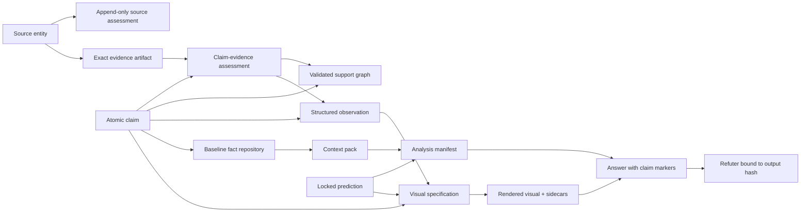

# Analyst Harness

A private, single-user research system for following a live, disinformation-heavy
conflict without rebuilding the same facts from scratch every session.

It has four jobs:

1. separate source identity, evidence, claims, assumptions, inferences, and forecasts;
2. maintain a small repository of carefully checked geography, history, definitions, and
   other reusable facts;
3. bind each answer to the exact claims, reviews, predictions, and visuals it uses;
4. generate charts, timelines, maps, and schematics from records rather than model memory.

> **Green means the requested checks genuinely ran and the recorded relationships are
> coherent. It never means reality signed the YAML.**

## v3 — rigor is opt-in (read this first)

v3 merges this design with a second one (see [MERGE_NOTES.md](MERGE_NOTES.md)) and adds the
thing that keeps it usable: **three tiers of rigor, default lightweight.**

- **Tier 0 — Conversational (default, most questions):** a direct answer with honest labels
  (fact / inference / assumption / projection + a coarse confidence), speculation encouraged
  and badged, one self-refute line. **No records, no manifest, no refuter.** Useful on day
  zero. This is the everyday mode.
- **Tier 1 — Recorded:** worth keeping → a candidate claim + evidence + assessment.
- **Tier 2 — Committed answer:** worth depending on → the full chain below.

The four jobs below are the machinery for Tiers 1–2. They exist so that *when you commit a
claim*, the rigor is there — **not** so that every question must pay for it. The design's
first priority is that answers stay useful and interesting; see Constitution §1.

## What changed in v2 (the rigorous core, retained in v3)

The first design treated a source identity as if it were evidence and used source type as
a rough reliability proxy. A low-reliability official statement could therefore qualify
a claim as confirmed merely by existing. Neat, fast, and wrong.

v2 replaces that shortcut:

- source **type** and assessed **reliability** are separate;
- an exact evidence artifact records what was actually retrieved;
- append-only claim-evidence assessments record the support locator, stance, credibility,
  temporal scope, origin chain, independence group, and semantic review for one claim;
- corroboration counts independent information origins, not outlet logos;
- claim type, support, dispute, freshness, lifecycle, and stability are separate axes;
- structured observations bind chartable values to exact claims and checked support, so
  renderers never mine numbers from prose;
- analysis manifests bind answers to record IDs and hashes;
- refuter coverage is checked against the manifest and output hash, not accepted as a
  cheerful boolean;
- predictions are locked in an append-only hash chain anchored outside mutable Git history;
- baseline facts and visuals now have explicit policies, tools, tests, and recurring-task
  skills.

## Architecture



A source entity is not evidence. An artifact is the exact article, statement, report,
post, dataset, image, or video retrieved. A claim-evidence assessment records which part
of that artifact bears on one atomic claim and how. The separation matters: the same
report can support one claim, refute another, and be irrelevant to a third.

## Honest verification modes

| Mode | Establishes |
|---|---|
| `scaffold` | governance, required files, dependencies, and schema availability |
| `records` | source, artifact, assessment, claim, observation, conflict, and freshness integrity |
| `draft` | records plus analysis-manifest and projection-link integrity |
| `answer` | draft plus output binding, visual hashes, and required refuter review |

None proves semantic truth. Exact support locators and adversarial review make judgment
inspectable; they do not automate it into existence.

## Value milestones

The plan has deliberate stop points. A personal tool that needs a small civil service to
operate will be bypassed precisely when the question is interesting.

1. **After Phase 3 — trustworthy private answers:** exact evidence, answer binding, and
   refutation work end to end.
2. **After Phase 4 — reusable research memory:** baseline queries and context packs start
   paying back prior verification effort.
3. **After Phase 5 — visual tools:** charts, timelines, maps, and schematics are available
   on request from validated records.
4. **After Phase 6 — forecast measurement:** locked predictions, benchmarks, and
   calibration views begin accumulating evidence about performance.

Phase 7 is optional semantic and retrieval assistance. It exists only if usage proves the
simpler system inadequate.

## Baseline fact repository

The repository has three compartments:

- **Durable facts** — stable geography, definitions, and structural facts. Inclusion test:
  would the proposition have been equally true a year ago and remain true a year from now?
- **Append-only history** — dated events that remain true but whose list grows.
- **Live facts** — current state, kept outside the baseline and expired aggressively.

Historical casualty totals, current force counts, and similar moving estimates do not
become durable merely because their dates are old. They remain dated, contested claims.

Real research is seeded only after the record and support gates exist. Candidate claims
are retrieved, assessed, reviewed, and promoted; they are never dictated from model
memory and blessed retrospectively.

## Visuals

Visuals are views of records, not new sources of facts.

- Charts consume typed observation IDs, including units, denominators, scope, and
  uncertainty.
- Maps use real geometry records, coordinate reference systems, and cached basemaps.
- Schematics use explicit nodes and edges and may be conceptual without pretending to be
  geographic.
- Every render emits a metadata sidecar and normalized data sidecar, then passes a
  post-render inspection step.

This is a private tool, so the design does not obsess over publication theatre. It does
retain the accuracy controls that protect the only reader who matters: the one making the
decision.

## Data handling

The repository aggregates conflict OSINT and can contain public identities, sensitive
locators, collection patterns, and contextual reliability assessments.

- **Private by default.** Do not publish or casually sync the repository.
- Source identities remain neutral. Reliability assessments are scoped, append-only, and
  separated from the identity registry.
- Signed URLs, private document IDs, local paths, and sensitive method notes belong in an
  ignored encrypted/private overlay, never tracked YAML.
- Public/redacted export is a separate future mode, not an optimistic `git push`.

## Repository map

```text
README.md
AGENTS.md
CLAUDE.md
IMPLEMENTATION_PLAN.md
REVISION_NOTES.md
VALIDATION_REPORT.md
docs/
  CONSTITUTION.md
  DATA_MODEL.md
  KNOWLEDGE.md
  TOOLING.md
  EXAMPLE_WORKFLOW.md
  PROGRESS.md
  REVIEW_ADJUDICATION.md
  RED_TEAM_BRIEF.md
  REVIEW_PROMPT.md
factbase/
  README.md
  sources.yaml
  source_assessments.yaml
  evidence.yaml
  claim_evidence.yaml
  observations.yaml
  predictions.yaml
  prediction_events.jsonl
  geography.yaml
  baseline_events.jsonl
  baseline/claims.yaml
  live/claims.yaml
skills/
  fact-repository/SKILL.md
  visuals/SKILL.md
```

## Planned commands

```bash
.venv/bin/python scripts/verify.py --mode scaffold
.venv/bin/python scripts/verify.py --mode records
.venv/bin/python scripts/verify.py --mode draft
.venv/bin/python scripts/verify.py --mode answer --analysis ana-001

.venv/bin/python scripts/fact.py query --topic crimea-logistics
.venv/bin/python scripts/fact.py context --topic crimea-logistics --output context.yaml
.venv/bin/python scripts/fact.py candidate --topic crimea-logistics --text "..."
.venv/bin/python scripts/fact.py assess --claim clm-001 --evidence evd-001
.venv/bin/python scripts/fact.py review-due
.venv/bin/python scripts/fact.py refresh --claim clm-001
.venv/bin/python scripts/fact.py promote --claim clm-001 --review ref-001
.venv/bin/python scripts/fact.py supersede --claim clm-001 --replacement clm-002

.venv/bin/python scripts/prediction.py lock prd-001
.venv/bin/python scripts/prediction.py resolve prd-001 --outcome true
.venv/bin/python scripts/prediction.py score

.venv/bin/python scripts/visual.py validate visuals/specs/vis-001.yaml
.venv/bin/python scripts/visual.py render visuals/specs/vis-001.yaml
.venv/bin/python scripts/visual.py inspect visuals/specs/vis-001.yaml
```

Canonical local commands use `.venv/bin/python`; there is no split-brain `python` versus
`python3` documentation.

## Status

**Design package only. No implementation code exists.** The v2 governance package is
intentionally blocked pending one cold external adversarial review and adjudication of
any new P0/P1 findings. See `docs/PROGRESS.md` and `docs/REVIEW_ADJUDICATION.md`.
